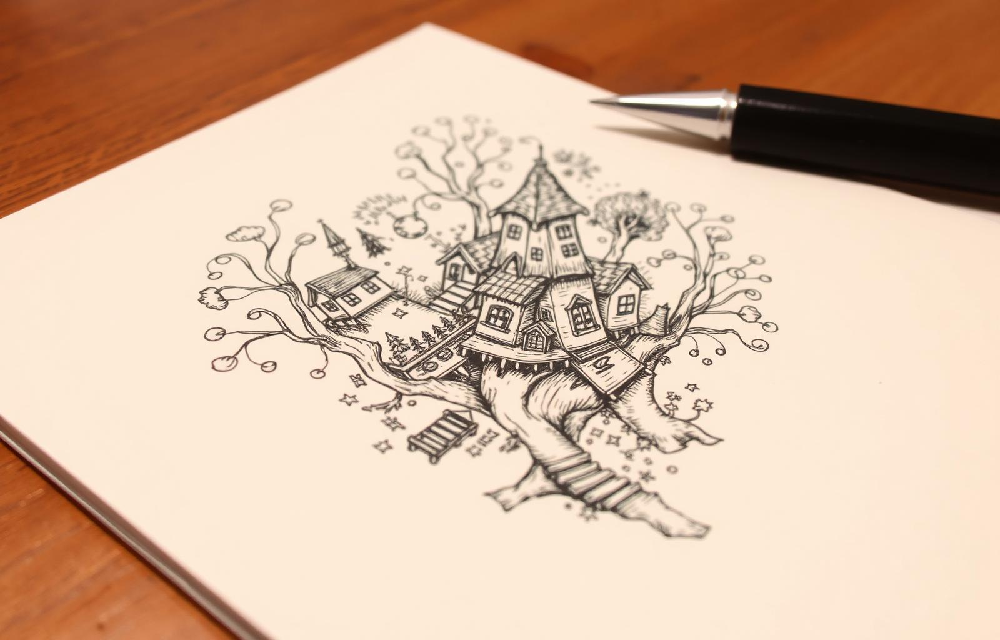

# bound.less

An infinite-zoom drawing canvas. Sketch a city, zoom into a window, draw the room inside — then keep going.

**Live demo: <https://bound-less-kk.web.app>**

> **Built with AI tools — [Claude Code](https://claude.com/claude-code), [Cursor](https://cursor.com), and [Lovable](https://lovable.dev).**
> This project was an exercise in modern AI-assisted engineering — the v2 zoom engine, its test harness, and the current UI were designed, debugged, and shipped in collaboration with these tools.



## What it does

- **Infinite zoom** — the canvas re-anchors itself every ×3,000 of magnification, so zoom depth is limited by your patience, not by floating-point precision or SVG limits. Draw detail at any depth and find it again on the way back out.
- **A full drawing kit** — pen, pencil, highlighter, and straight-line tools; select / move / restyle; undo-redo across everything.
- **Real-world scale** — drag across anything you've drawn and declare "this is 1 inch" (or 40 meters, or 3 miles). A scale bar then tracks every zoom, walking a ladder of sensible units from millimeters to miles as you dive and climb.
- **Auto-scenes** — the coherent drawings hidden inside a canvas are discovered automatically by deterministic, width-relative ink clustering (spec: [`docs/auto-scenes-design-bible.md`](docs/auto-scenes-design-bible.md)), including nested "pockets" of fine detail that would otherwise be lost in the zoom. Scenes get rendered thumbnails and one-tap jumps at their natural zoom; rename, split, or delete them, or capture any view by hand.
- **Local-first saving** — work autosaves to your browser and stays there by default. Sign in with Google to sync canvases (thumbnails included) to your account and pick them up on any device. Drawings also export and import as `.boundless.json` files, plus SVG export.

## How the engine works

The interesting problem: browsers (and doubles) give out long before "infinite." The engine in [`src/engine/`](src/engine) treats depth as a chain of **levels**, each ×3,000 the magnification of the last, and keeps all geometry in the coordinate frame of the level where it was drawn:

| Piece | Job |
| --- | --- |
| `Camera` | Level-local view transform; crosses between levels when zoom passes enter/exit thresholds (with hysteresis so the boundary doesn't flicker) |
| `Document` | Strokes live in their home level; ids double as z-order; undo/redo as operation log; spatial index for hit-testing |
| `LevelMap` / `TileStore` | Cross-level views are *derived*: bidirectional tiles with empty / solid / edge classification, so a stroke magnified ×3,000⁵ collapses to bounded tile fills instead of exploding |
| `Renderer` | The only owner of Two.js; persistent per-object SVG groups, updated by diffing, with per-level scene retention so level crossings reattach instead of rebuilding |
| `geometry/` | Curve-capsule outlines (Tiller–Hanson offset fitting) keep wide strokes exact at any zoom; polygon clipping bakes the cross-level tiles |
| `persist.js` | Versioned save format (`kobin-1`) with validation and migration from the legacy dev format |
| `scaleBar/` | The real-unit scale system: unit catalogs, preference "ladders," and sticky per-session display choices |

The suite is ~290 Jest tests, including a fidelity harness that replays recorded drawings and compares rendered ink against ground truth pixel-for-pixel across level crossings. The full design history — bugs, dead ends, measured perf wins (one pathological tile bake went from 585 s to 550 ms) — lives in [`docs/issue-log.md`](docs/issue-log.md) and the design documents beside it.

## Run it locally

Requires **Node 14** — the toolchain is an older Create React App setup.

```bash
npm install
npm start        # http://localhost:3000
npm test         # jest suite
npm run build    # production build to build/
```

Deploys are plain Firebase Hosting: `firebase deploy --only hosting` (config in `firebase.json`).

**Dev tools:** append `?dev` to a canvas URL (e.g. `/#/canvas/new?dev`) to reveal the engine's developer panel — live level/zoom/object readouts and rendering toggles. `/#/v2` is the raw engine test harness.

## Roadmap

- AI-suggested scene names (Gemini's free tier — once the build toolchain modernizes enough for Firebase AI Logic)
- Rotation and measurement tools

## History

bound.less began in 2021 as a university team project by Michael Sawchuk, Kobin Kempe, Anuja Mehta, and Nolan Raghu, which proved out the idea but stopped at SVG's practical zoom limits. This repository is Kobin Kempe's continuation: the v2 level-crossing engine, the drawing and selection toolset, the real-unit scale system, account sync, and the current interface.
