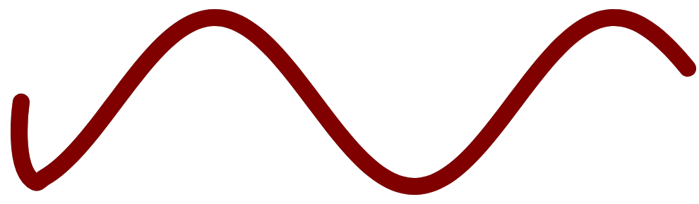

# Outline fidelity fix — report

**Branch:** `v2`  ·  **Route:** `/#/v2`  ·  **Files:** `src/engine/clipperOutline.js`, `src/engine/KobinEngineV0.js`

## TL;DR

The **Outline** toggle now converts a pen stroke into a filled shape that matches
what the browser actually paints, to within anti-aliasing. On a curvy test stroke
(33,346 px of stroke area) the new outline has **0 px of solid disagreement** with
the browser's own stroke rendering (only ~0.2 % one-pixel AA fringe). The old code
had **~1,900 px of solid mismatch** — that was the "the shape changes when I toggle
Outline" bug.

## What was wrong

A stroke is stored as a thin **centerline** (`pts`) plus a **width**. To make a
filled outline you offset the centerline by ±width/2 with round caps/joins. The old
`strokeOutline` offset the **raw straight chords between the input points**. But the
displayed stroke isn't straight chords — Two.js draws a *curved* stroke as a
Catmull-Rom-like **cubic Bézier** through those points (tension 0.33; see
`node_modules/two.js/src/utils/curves.js` → `getControlPoints`, and
`renderers/svg.js`, which emits each segment as `C a.right b.left b`). So the
outline traced a different shape than the stroke — most visibly at high-curvature
spots and caps. A secondary issue: the Clipper arc tolerance was a fixed value in
frame units, so round caps/joins faceted when a baked outline was magnified.

## Research / libraries

Stroke-to-fill is a standard operation: offset the path by half the stroke width on
each side and fill between, with round joins = a circular arc at the vertex and
round caps = a semicircle at each end; curves must be **flattened to a polyline
first** because the exact offset of a Bézier isn't itself a Bézier.

- **Clipper (`clipper-lib`, already a dependency)** — the specialized polygon
  offset+union library. **Chosen.** No new dependency.
- **paper.js** — general vector lib, but has *no* native stroke-to-path; rejected.
- **Skia / CanvasKit (WASM)** — literally Chrome's renderer and pixel-exact, but a
  ~7 MB WASM payload; overkill here. Noted as a future option if we ever need
  boolean ops at Skia fidelity.
- **bezier-js** — listed in the design doc but **was never actually installed**; its
  per-curve `.outline()` would still need Clipper to union multi-segment results.

The fix is to use Clipper *correctly*, not to swap libraries.

Sources:
- [W3C SVG Strokes](https://www.w3.org/TR/svg-strokes/)
- [MDN — Fills and strokes](https://developer.mozilla.org/en-US/docs/Web/SVG/Tutorials/SVG_from_scratch/Fills_and_strokes)
- [paper.js issue #371 — stroke outlining](https://github.com/paperjs/paper.js/issues/371)

## The fix

In `clipperOutline.js`:

1. **`flattenCurve(pts, tol)`** — a faithful re-implementation of Two.js's curve.
   It computes each anchor's cubic handles exactly as `getControlPoints` does
   (including the degenerate endpoint handles, since Two.js anchors are `relative`
   with controls initialised to the anchor), then flattens each cubic with recursive
   de Casteljau subdivision (AGG flatness metric) to a tolerance. The result is the
   *same* centerline the browser strokes.
2. **`strokeOutline(points, width, opts)`** — now offsets the flattened curve (when
   `curved`) instead of the raw chords, and sizes the flatten + arc tolerances from
   a fixed **on-screen pixel budget** (`arcTolerancePx / displayScale`) so the
   outline is equally smooth at any zoom depth. The Clipper integer scale is also
   tied to `displayScale` for ~0.01 px precision.

In `KobinEngineV0.js`:

3. `_buildPaths` passes `curved` and `displayScale: this.inScale` into
   `strokeOutline` so the outline matches the displayed stroke's curve mode at the
   current zoom.
4. `zoomAt` **re-bakes outlines on zoom while Outline mode is on**, so the round
   caps/joins stay smooth instead of faceting as a single baked polygon is magnified
   within a level. (Strokes don't need this — the browser re-renders them — so the
   cost is outline-mode-only.)

## Testing

All tests run in Chrome against the live engine on `/#/v2`.

### 1. Quantitative pixel diff vs ground truth

Ground truth = the **real Two.js Bézier path** stroked by the browser's own
rasterizer (Canvas2D `ctx.stroke()`, which is the same Skia engine SVG uses).
Candidate = the shipped `strokeOutline` polygons, filled by the browser
(`ctx.fill()`). Compare the two masks pixel-by-pixel. "Strong" mismatch = a pixel
solidly on in one and fully off in the other (i.e. real geometry error, not an AA
edge pixel).

Curvy stroke, width 24, 33,346 px of stroke area:

| | stroke uncovered | outline overshoot | **solid mismatch** |
|---|---|---|---|
| **NEW** (flattened Bézier) | 70 px (0.21 %) | 76 px (0.23 %) | **0 / 0** |
| **OLD** (raw chords) | 1,240 px | 1,048 px | **1,059 / 884** |

The NEW differences are entirely 1-px-wide AA fringe; there is no solid disagreement.

### 2. Red/black overlay (the requested method)

The real stroke drawn in black with the outline filled **red at 50 %** on top.
Perfect coincidence reads as uniform maroon; black-only = stroke uncovered, pure red
= overshoot. Result: uniform maroon end-to-end with smooth round caps
(`01_curve_overlay.png`). The before/after (NEW vs OLD) shows the OLD straight-chord
outline leaking black + red at the high-curvature start hook.

### 3. Magnified edge (re-bake on zoom)

Zoomed into a stroke's top edge at **128×**. A vertical pixel scan across the edge
steps straight from white to maroon in a single pixel (transition at y=388), with no
black-only band and no facets — the re-baked outline edge sits exactly on the stroke
edge under magnification.

## Limitations / notes

- **Re-bake cost:** outline mode re-runs Clipper on every zoom tick. Fine for a few
  objects; for many objects this needs culling / caching (already on the roadmap).
  Default stroke mode is unaffected.
- **Deep zoom into a thick stroke's middle** shows no edges (both offset edges are
  far off-screen by definition); that's geometry, not an outline defect.
- Round caps/joins are Clipper arc approximations, but at `0.25 px` arc tolerance
  they are sub-pixel; tighten `arcTolerancePx` if ever needed.
- This makes faithful early polygonization viable (the motivation): a stroke can be
  converted to a window-clippable filled polygon that is visually identical to the
  stroke, so deep levels can work with bounded polygons instead of centerlines whose
  control points run off-screen.

## Reproduce

1. `/#/v2`, draw a curvy stroke, toggle **Outline** — shape is unchanged (was the bug).
2. Engine is exposed as `window.__kobinEngine`; outline polygons are readable via
   `engine._objs()[0].paths[i]._renderer.elem.getAttribute('d')` for diffing.

## Follow-ups (second pass)

### Loop fill bug — holes now render

A self-enclosing loop filled solid in Outline mode because each Clipper ring was a
separate filled `Two.Path`. Two.js 0.7.1 has no fill-rule/holes API, but its
`toString` emits a fresh `M` for any vertex with a `move` command — so the outline is
now built as **one manual compound `Two.Path`** (all rings concatenated, first vertex
of each = `move`, rest = `line`, closed/manual). Clipper emits holes with opposite
winding, so the default nonzero fill rule cuts them out. Verified: a drawn ring shows
2 sub-paths, hollow center, filled band.

### Size-gated polygonization at the crossing

`_crossUp` now gates each stroke by its **on-screen width at the crossing**
(`lwFrame * s`). Config `polygonizeWidthFrac` (default **1/3**):

- `screenW ≤ page × 1/3` → keep as a **clipped stroke** in the new frame (the fine
  detail drawn around 250–300×, which stays small on screen, stays vector).
- `screenW > page × 1/3` → **outline + window-clip to a fill**. These big background
  strokes are so magnified their centerline runs far off-window; as bounded polygons
  they're stable. (Outlining the window-clipped centerline bounds the work; clip-end
  caps land beyond the window and are removed by the poly clip.)

Verified: a 1× background stroke (≈6000 px on-screen at 300×) → `fill`; detail drawn
at 294× (20 px on-screen) → `stroke`.

### Performance

Profiling (one ~167-pt curved stroke):

| operation | before | after |
|---|---|---|
| `_crossUp` (a crossing) | 0.3 ms | 0.3 ms |
| stroke-mode render | 0.95 ms | 0.95 ms |
| outline re-bake tick @1× | 9.5 ms | ~1 ms avg over a sweep |
| outline re-bake tick **@120×** | **176 ms** | **4.8 ms** |

Crossings/kobinization were never the bottleneck — the slowdown was the
re-bake-on-zoom: it flattened the *entire* (mostly off-screen) curve at a
`1/displayScale` tolerance every wheel tick. Two fixes: **(1) clip the centerline to
the visible window before outlining** (cost ∝ what's on screen, not curve length);
**(2) re-bake only when scale moves >25%** since the last bake, not every tick
(between bakes the world transform magnifies the last polygon — sub-perceptible).
Pan also re-bakes in outline mode now (cheap, since window-clipped).

### Remaining speedup options (not yet done)

- **Cache** inherited kobinized copies per level (today they recompute on re-entry).
- **Cull** off-window objects via a spatial index before processing a crossing.
- **Reuse** `Two.Path` vertex buffers instead of recreating paths each render.
- **Web Worker** for Clipper offset/clip to keep the main thread jank-free.
- **Debounce** the settled outline re-bake (one crisp bake ~60 ms after zoom stops).
